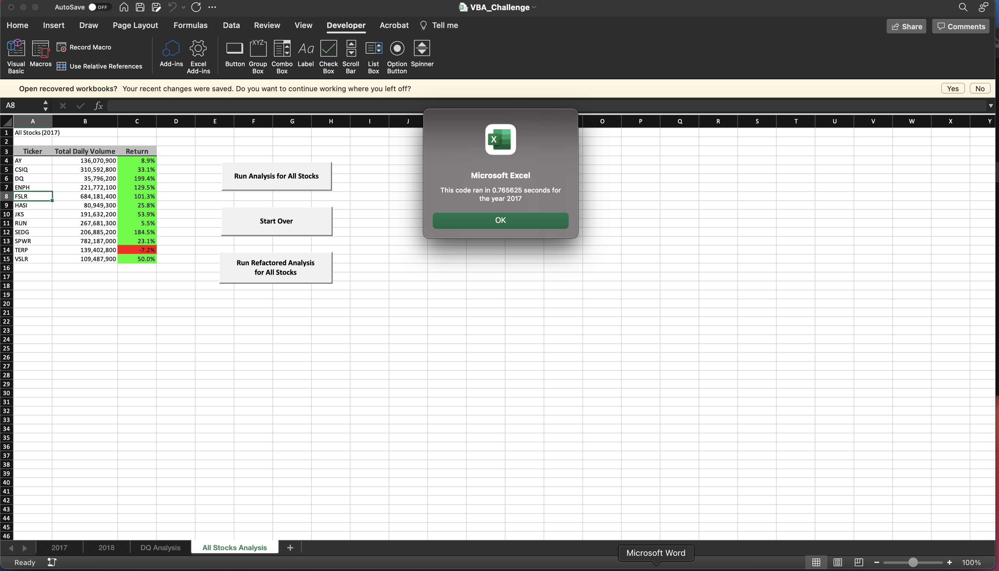
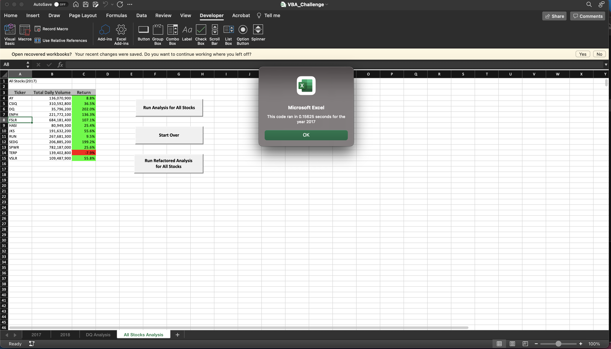
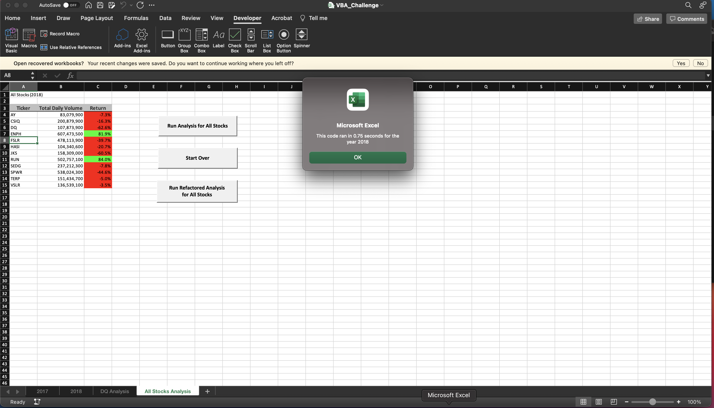
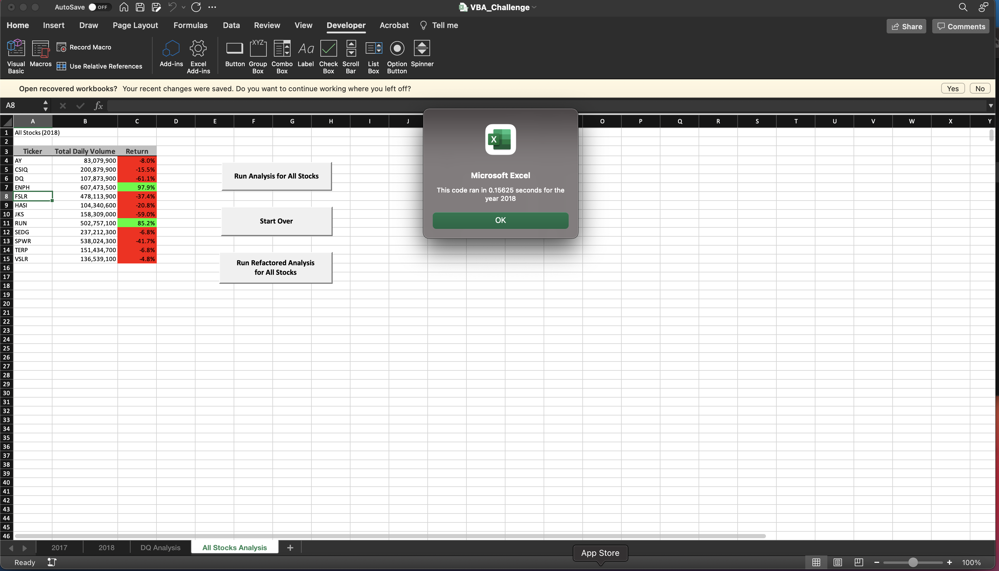
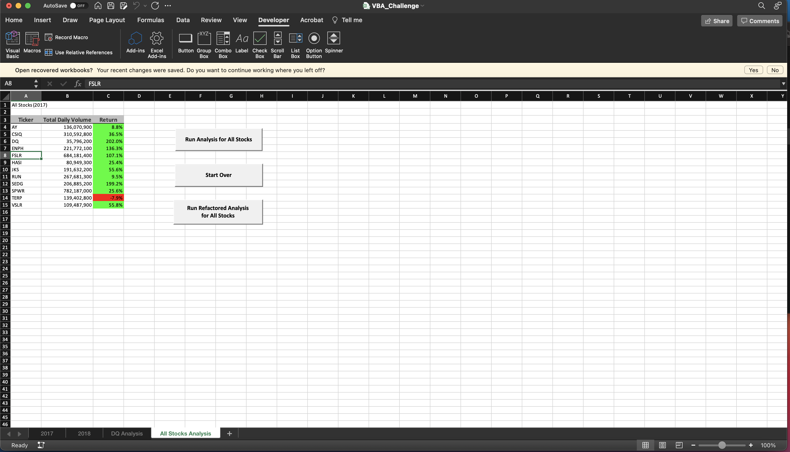

# Green Stock Analysis
## Purpose
### This analysis aims to 
Results: Using images and examples of your code, compare the stock performance between 2017 and 2018, as well as the execution times of the original script and the refactored script.
This is a comparison of execution times is original and refactored codes:

This is a comparison of performance of green stocks:

Summary: In a summary statement, address the following questions.
What are the advantages or disadvantages of refactoring code?
How do these pros and cons apply to refactoring the original VBA script?
