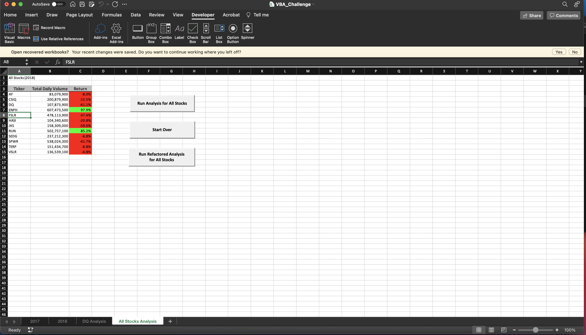

# Green Stock Performance Analysis

## Purpose

### This analysis aims to compare the performance of green stocks between the years 2017 and 2018 based on the data with which we were provided. We performed analyses using Macros in VBA to create comparisons of all stocks in our dataset more efficiently. Furthermore, using VBA programming, we were able to create interactive tools that - optimized even further by code refinement - are capable of populating tables with relevant information and making our understanding of data analysis fast, captivating and dynamic. 

## Results

### All green stock tickers, glanced in a general way, show much poorer returns in 2018 than in 2017, with the exception of ENPH and RUN tickers. The TERP ticker was the only ticker that showed negative results in 2017 as well as 2018. In 2018, the ENPH ticker showed a decrease in returns, but its returns remained positive. RUN ticker, however, showed a significant increase in return from 2017 to 2018, against the general trend. This would signify, in a preliminary analysis, using the data we have, that RUN would have been the most profitable green stock to have invested in between the years of 2017 and 2018.

### These screenshots illustrate the comparison of performances of green stocks in the years 2017 and 2018:

### When creating VBA Macros for analysis execution, we observed better performances by refactoring the original codes we had created.

### This is the execution time of the original code in the 2017 analysis:

### This is the execution time of the refactored code in the 2017 analysis:

### This is the execution time of the original code in the 2018 analysis:

### This is the execution time of the refactored code in the 2017 analysis:

## Summary 

### Refactoring a code can enhance the performance and execution of code in VBA Macros. Refactoring can also be time consuming, and the advantanges of more efficient execution and faster performance may not always outweigh the cost of time and energy reformulating code. Mostly, refactoring provides an opprotunity to review VBA codes and make them more elegant and effective, making the effort generally worthwhile.
